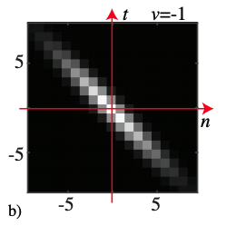
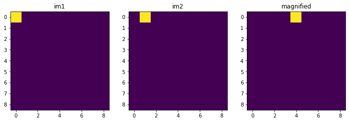
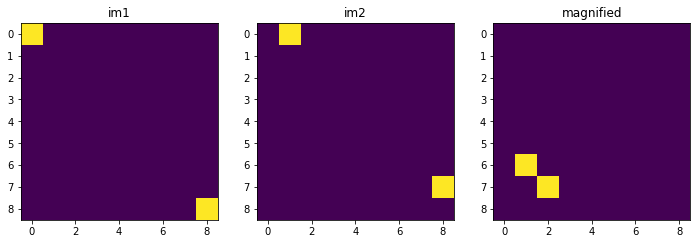
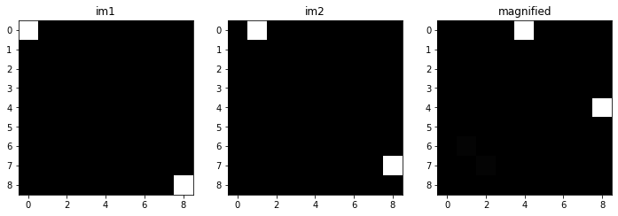

# Motion Magnification
## CSC-676 Homework 4 / American University
Author: [Yunting Chiu](https://www.linkedin.com/in/yuntingchiu)\
April 03, 2021
Yunting Chiu adapted from Bei Xiao. Instructor: Dr. Xiao

| Applying temporal Gaussian filter to amplify videos. |
|:--------------------:|
||

### Purpose
In this task, we will look at video motion magnification. Keep in mind that phase changes in the frequency domain of the Fourier transform lead to location shifts in image space. This implies that the phase shift between two images can be calculated by comparing their Fourier transforms. After the inverse Fourier transform, magnifying the phase change by a fixed factor in the Fourier transform frequency domain would amplify the position shift by the same factor in the image domain. This idea can be used in videos to exaggerate movements.

## Magnify Change

Firstly, we compute the prase shift between img2 to img 1 in the Fourier transform domain as `phaseShift`. Second, we utilize the position of the origin image to time the exponential of `magnificationFactor` x `phaseShift` x complex number, which magnifies the phase change in frequency domain (`magnifiedDft`). Thirdly, we inverse `magnifiedDft` and keep the real part to get the magnified image as magnified.

    # install the libraries
    %matplotlib inline
    import numpy as np
    from numpy.fft import fft2, ifft2, fftshift, ifftshift
    from numpy import angle, real
    from numpy import exp, abs, pi, sqrt
    import matplotlib.pyplot as plt
    import cv2
    from google.colab.patches import cv2_imshow
    import imageio
    
    def imshow(im, cmap='gray'):
        # clip image from 0-1
        im = np.clip(im, 0, 1)
        plt.imshow(im, cmap=cmap)
    
    # 9x9 images
    imSize = 9
    
    # we would like to magnify the change between im1 and im2 by 4x
    magnificationFactor = 4;
    
    # horizontal movement from (0, 0) to (0, 1)
    im1 = np.zeros([imSize, imSize])
    im2 = np.zeros([imSize, imSize])
    im1[0,0] = 1
    im2[0,1] = 1
    
    ff1 = fftshift(fft2(im1))
    ff2 = fftshift(fft2(im2))
    
    def magnifyChange(im1, im2, magnificationFactor):
    
    # find phase shift in frequency domain
    im1Dft = fft2(im1)
    im2Dft = fft2(im2)
    phaseShift = angle(im2Dft) - angle(im1Dft) # TODO
    
    # magnify the phase change in frequency domain
    magnifiedDft = im1Dft * np.exp(magnificationFactor * phaseShift * 1j) # TODO
    
    # what does the magnified phase change cause in image space?
    magnified = np.fft.ifft2(magnifiedDft).real; 
    
    return magnified

    # magnify position change
    magnified = magnifyChange(im1, im2, magnificationFactor);
    
    plt.figure(figsize=(12,36))
    plt.subplot(131)
    plt.imshow(im1); plt.title('im1');
    
    plt.subplot(132)
    plt.imshow(im2); plt.title('im2');
    
    plt.subplot(133)
    plt.imshow(magnified); plt.title('magnified');

### Output

We now have two phases, meaning that we must move in two directions (vertical and horizontal). Because the `magnifyChange` function can only be applied to one phase and cannot determine which phase should be moved. Thus, multidirectional phases cannot be properly magnified. Please see the plot below.

    # 9x9 images
    imSize = 9
    
    # we would like to magnify the change between im1 and im2 by 4x
    magnificationFactor = 4
    
    # horizontal movement from (0, 0) to (0, 1)
    # additional vertical movement from (8, 8) to (7, 8)
    im1 = np.zeros([imSize, imSize])
    im2 = np.zeros([imSize, imSize])
    im1[0,0] = 1
    im2[0,1] = 1
    im1[8,8] = 1
    im2[7,8] = 1
    
    # magnify position change
    magnified = magnifyChange(im1, im2, magnificationFactor)
    
    
    plt.figure(figsize=(12,36))
    plt.subplot(131)
    plt.imshow(im1); plt.title('im1');
    
    plt.subplot(132)
    plt.imshow(im2); plt.title('im2');
    
    plt.subplot(133)
    plt.imshow(magnified); plt.title('magnified');

### Output

## Gaussian Motion Magnification

How can we solve the problem if the motion is multidirectional? If there are several movements between two images, one solution is to use a localized Fourier transform, which involves individually magnifying the offsets on small windows of the images and aggregating the effects across the windows. When we narrow our scope of consideration, everything in it is more likely to move in the same direction.

    # 9x9 images
    imSize = 9
    
    # we would like to magnify the change between im1 and im2 by 4x
    magnificationFactor = 4
    
    # width of our Gaussian window
    sigma = 2
    
    # horizontal movement from (0, 0) to (0, 1)
    # additional vertical movement from (8, 8) to (7, 8)
    im1 = np.zeros([imSize, imSize])
    im2 = np.zeros([imSize, imSize])
    im1[0,0] = 1
    im2[0,1] = 1
    im1[8,8] = 1
    im2[7,8] = 1
    
    # we will magnify windows of the image and aggregate the results
    magnified = np.zeros([imSize, imSize])
    # magnified = np.zeros(imSize)
    
    # meshgrid for computing Gaussian window
    [X, Y] = np.meshgrid(np.arange(imSize), np.arange(imSize))
    print(X)
    
    for y in range(0, imSize, 2*sigma):
      for x in range(0, imSize, 2*sigma):
        gaussianMask = np.exp(-((X-x)**2 + (Y-y)**2) / (2*sigma**2)) # TODO
        gaussianIm1 = im1 * gaussianMask # TODO
        gaussianIm2 = im2 * gaussianMask # TODO
        windowMagnified = magnifyChange(gaussianIm1, gaussianIm2, magnificationFactor) # TODO
        magnified = magnified + windowMagnified
            
    plt.figure(figsize=(12,36))
    plt.subplot(131)
    imshow(im1); plt.title('im1');
    
    plt.subplot(132)
    imshow(im2); plt.title('im2');
    
    plt.subplot(133)
    imshow(magnified); plt.title('magnified');

### Output

## Appling Motion Magnification to a Video

    Read the video on Google Colab
    
    import numpy as np
    import cv2
    
    cap = cv2.VideoCapture('Yunting.avi')
    
    # list of video frames
    frames = []
    
    while(cap.isOpened()):
        # read frame from the video
        ret, frame = cap.read()
        
        if ret is False:
            break
            
        frames.append(frame)
    
    cap.release()
    
    # scale frame to 0-1
    frames = np.array(frames) / 255.
    print("frames size:", frames.shape, "# (nb_frames, height, width, channel)")
    
    # get height, width
    numFrames = frames.shape[0]
    height = frames.shape[1]
    width = frames.shape[2]
    
    print(numFrames, height, width)

## Video Motion Processing

    # 10x magnification of motion
    magnificationFactor = 10 # default 10
    
    # width of Gaussian window
    sigma = 50 # default 13
    
    # alpha for moving average
    alpha = 0.5
    
    # we will magnify windows of the video and aggregate the results
    magnified = np.zeros_like(frames)
    
    # meshgrid for computing Gaussian window
    X, Y = np.meshgrid(np.arange(width), np.arange(height))
    
    # iterate over windows of the frames
    xRange = list(range(0, width, 2*sigma))
    yRange = list(range(0, height, 2*sigma))
    numWindows = len(xRange) * len(yRange)
    windowIndex = 1
    
    for y in yRange:
        for x in xRange:
            for channelIndex in range(3): # RGB channels
                for frameIndex in range(numFrames):
                    
                    # create windowed frames
                    gaussianMask = np.exp(-((X-x)**2+(Y-y)**2) / (2*sigma**2)); # TODO
                    windowedFrames = gaussianMask * frames[frameIndex,:,:,channelIndex]
                
                    # initialize moving average of phase for current window/channel
                    if frameIndex == 0:
                        windowAveragePhase = angle(fft2(windowedFrames))
                    
                    windowDft = fft2(windowedFrames) 
                    
                    # compute phase shift and constrain to [-pi, pi] since
                    # angle space wraps around
                    windowPhaseShift = angle(windowDft) - windowAveragePhase
                    windowPhaseShift[windowPhaseShift > pi] = windowPhaseShift[windowPhaseShift > pi] - 2 * pi
                    windowPhaseShift[windowPhaseShift < -pi] = windowPhaseShift[windowPhaseShift < -pi] + 2 * pi
                    
                    # magnify phase shift
                    windowMagnifiedPhase = magnificationFactor * windowPhaseShift  # TODO
                     
                    # go back to image space
                    windowMagnifiedDft = windowDft * np.exp(windowMagnifiedPhase*1j) # TODO
                    windowMagnified = abs(ifft2(windowMagnifiedDft))
                    
                    # update moving average
                    windowPhaseUnwrapped = windowAveragePhase + windowPhaseShift
                    windowAveragePhase = alpha * windowAveragePhase + (1 - alpha) * windowPhaseUnwrapped
                    
                    # aggregate
                    magnified[frameIndex,:,:,channelIndex] = magnified[frameIndex,:,:,channelIndex] + windowMagnified
            
            # print progress
            print('{}/{}'.format(windowIndex, numWindows), end='\r')
            windowIndex += 1
    
    
    outputs = magnified / np.max(magnified)
    for channelIndex in range(3):
        originalFrame = frames[0,:,:,channelIndex]
        magnifiedFrame = outputs[0,:,:,channelIndex]
        scale = np.std(originalFrame[:]) / np.std(magnifiedFrame[:])
        originalMean = np.mean(originalFrame[:])
        magnifiedMean = np.mean(magnifiedFrame[:])
        outputs[:,:,:,channelIndex] = magnifiedMean + scale * (outputs[:,:,:,channelIndex] - magnifiedMean)
    
    outputs = np.clip(outputs, 0, 1)
    
    
    # create output video
    fourcc = cv2.VideoWriter_fourcc('M','J','P','G')
    # fourcc = cv2.VideoWriter_fourcc(*'XVID')
    out = cv2.VideoWriter('Yunting_magnified10.avi' ,fourcc, 30.0, (height, width))
    
    for i in range(frames.shape[0]):
        # scale the frame back to 0-255
        frame = (np.clip(outputs[i], 0, 1) * 255).astype(np.uint8)
        
        # write frame to output video
        out.write(frame)
    
    out.release()
    
    
    # Only for colab downloading videos
    try:
        from google.colab import files
        files.download('Yunting_magnified10.avi')
    except:
        print("Only for google colab")

### Results in a table
- Please click the images to see the videos of magnification with Phase-Based Motion Processing

| Original Video     |
|:--------------------:|
| |

| 10x Magnification     |
|:--------------------:|
|  |

| 30x Magnification     |
|:--------------------:|
| |

I was able to magnify the video called Bill by 10x and 30x. Because the running time of this video is not too long, the code can be worked on smoothly. I attempted to use HD video even or 4K video for motion magnification, but running these code above consumes a lot of RAM, which takes a long time and causes the code to fail. As a result, I only focus on low-quality videos as a remedy.

### Conclusion

The thorny problem is that the original code has four layers for loops (frames, width, height, channel), which causes the code to fail on CoLab and locally. I tried many low-quality videos (less than 1MB), but the RAM was full. One solution for processing large videos is to upgrade to CoLab pro or to consider GPU resources.

### Reference
- Wadhwa, N., Rubinstein, M., Durand, F., & Freeman, W. (2013). Phase-based video motion processing. *ACM Transactions on Graphics, 32*(4), 1–10. https://doi.org/10.1145/2461912.2461966

**Please visit my [GitHub](https://github.com/twyunting) page if you are interested in knowing more about my academic projects in Computer Vision.**
